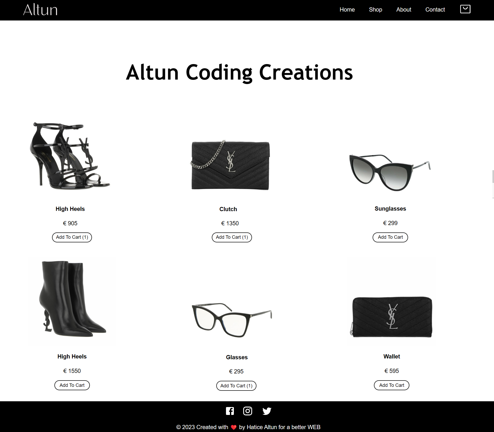

# Altun | Creation Shop

# Build with
* [Create React App](https://github.com/facebook/create-react-app).

## Final Result

## Installation
Once you have cloned the project to your local machine, first install the node_modules
by running the following command in the terminal:

`npm install`

When this is done, you can launch the application using:

`npm start`

or use the WebStorm button (npm start). Open [http://localhost:3000](http://localhost:3000) to
view the page in the browser. 
